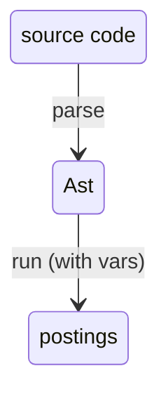
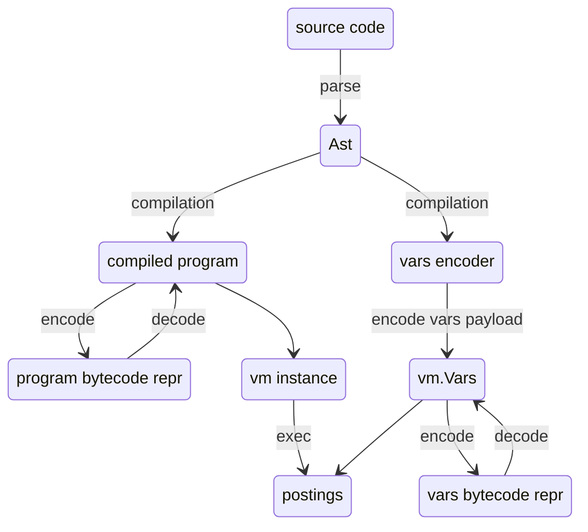

# Numscript vm architecture

## Design goals

Because of new requirements in the ledger v3, we are redesigning how numscript is architected.
Previous architecture (still implemented in this repo) consisted in a simple data flow:
We parsed the ast, and then walked the Ast to interpret it and emit postings:



while this is the simplest architecture we could implement, and its performance was still good enough for our use cases, a few things changed with the ledger v3 design:

1. Higher ledger TPS: numscript is more likely to become a bottleneck. So it's now justified to pay with more complexity for better perfs. Tree walker interpreter is usually suboptimal, has a lot of pointer chasing, and makes it hard to optimise things
2. It needs a way to send the programs around the nodes in a compact and efficient way. This could be solved in the previous architecture by using the syntax itself as a serializations format, or with some rpc encoding, but would still require complex operations on the nodes
3. We now have a specific section which is sequential and needs maximum perf. So we now prefer an architecture that allows to have pre-computed optimisations in the parallel path, so that the sequential one is highly optimised

that lead to researching a new implementation that would fit those design goals better

## The overall architecture

We now compile the parsed Ast (using `compiler.Compile`) and get a `vm.Program` struct and a `compiler.VarsEncoder` struct (or a compilation error). The compiler can optionally run an optimisation pass.

The `vm.Program` is used to create a `vm.Vm` instance (via `vm.NewVm`). Creating a `vm.Vm` instance will allocate the relevant registers and data, but it's designed so that we can reuse the same `vm.Vm` instance across execution of the same program.

The `VarsEncoder` struct knows how to encode a json payload (a `map[string]string`) into `vm.Vars`.

Finally, we can obtain our postings and meta output by running the `vm.Exec` function, by passing the `vm.Vm` instance, a `Store` implementation (used by the vm to fetch balances and meta), and the `vm.Vars`.

An important property: Both `vm.Program` and `vm.Vars` can be encoded and decoded as bytes. This way, we can orchestrate the previously mentioned flow:

- The leader node can parse and pre-compile numscript into a `vm.Program` and keep the `compiler.VarsEncoder`. The `vm.Program` is serialised into bytes and sent to nodes, which'll deserialise it into `vm.Program` again, and used to create the instance of the `vm.Vm`.
- On each tx, the leader takes the json payload and turns it into `vm.Vars` with the `vm.Encoder`. `vm.Vars` are serialised, sent and deserialised back. Now node can finally run the highly optimised warm `vm.Vm` instance.

Diagram is roughly like this:



In the next section we'll see how each of those building blocks works exactly

## Vm architecture

The vm's instance is composed by:

- the `vm.Program` (the compilation artifact)
- registers
- the runtime's state, which keeps track of allocated funds and the accounts' balances.

The bytecode's instructions have a fixed 32bit size:

```go
package vm

type Instruction struct {
	Opcode byte
	A      byte
	B      byte
	C      byte
}
```

Because of the fixed-size, the vm can keep the hydrated buffer of `[]Instruction` stream instead of having to parse things on the fly at runtime (or without having to model it via heap-allocated structs) while still being compact enough to benefit good CPU locality.

Instructions come in 2 formats: either `ABC` (3 arguments of 1 byte each) or `ABB` (2 arguments, with 1 having 1 byte size and the other a little endian repr of 2bytes).
If an instruction doesn't fit the 4 bytes limit, we simply extend it with the `Instruction` after that.

Instructions are fetched and evaluated one at the time until they are finished (no HALT instructions to stop, so that bytecode always terminates by design).

Instructions can move data by manipulating registers. Registers banks are separated by type (so that we don't have to have a single heap-allocated value, nor unsafe pointers or manually handled unsafe memory). With "type" here we mean the internal representation of data, which isn't the same as numscript types (there isn't necessarily a 1-1 relationship). For example, both strings, assets and accounts are represented via the golang `string` type. The `bool` bank is the other direction: it has no numscript counterpart at all, and exists so that a branch condition can't be a monetary quantity.

> Note: we'll probably change accounts' representation when adding scopes

A simple example of an instruction is:

```
INT_ADD 0x00 0x01 0x02
```

which behaves like this:

```
int_registers[0x00] = int_registers[0x01] + int_registers[0x02]
```

Note that this model plays very well with golang's `big.Int` mutable API.

The instruction set has

- a few pure, binary or unary arithmetic/logic operations (int min, string add, int add, portion sub, etc)
- a few domain instructions which call the `runtime.RunState`'s API (such as `PULL_ACCOUNT`, `SEND_TO_ACCOUNT`, `SAVE`). Those domain primitives can allocate funds, pull them to allocate postings, etc. This runtime logic is shared with the interpreter implementation.
- conditional jumps (`JMP_IF_ZERO`), which can only jump forward (so that the vm always halts by design)
- a `MK_ALLOTMENT` instruction which computes the allotment-related calculations
- constant pool loading instructions: `LOAD_STR(dest:u8, idx:u16)`, which performs `str_regs[dest] = program.str_pool[idx]`, and `LOAD_INT`.
- `LOAD_VAR_STRING(dest:u8, idx:u16)`, which performs `str_regs[dest] = vars.str_pool[idx]`, and `LOAD_VAR_INT` instructions, to load vars encoded in the `vm.Vars` struct

The VM implementation itself is trivial, and most of the complexity is moved to the compiler

### Bytecode encoding

The program bytecode encoding is designed so that the hydration can be fast, and so that it stays stable across versions.

After a magic word (so that we reject right away random bytes that didn't come from the compiler), we have a small header with a format version and the number of sections. The version lets a decoder reject a payload encoded by a newer, incompatible version instead of silently misreading it.

```
| "NUMB"                   4 B  | magic
+-------------------------------+
| version : u16            2 B  | header
| count   : u16            2 B  |
+-------------------------------+
| section 0                     | sections
| section 1                     |
| ...                           |
| section `count`-1             |
+-------------------------------+

section
+-----------+-----------+---------------+
| tag : u16 | len : u32  | content ...  |   len = content byte length
+-----------+-----------+---------------+
  2 B         4 B
```

Each section id identified by its `tag` identifier. `len` is the number of bytes it takes.

Current sections are

- Instructions, hydrated into a `[]vm.Instruction` slice
- Str pool, hydrated into a `[]string` slice
- Int pool, hydrated into a `[]big.Int` slice

Missing sections are valid and considered as empty. Unkown sections are allowed and skipped, unless the 15-th bit(`0x8000`) is set; in that case the program is rejected.

> Note: the compiler is free to arrange the sections in any order (e.g. it may pad or align them in future optimizations)

> Note: this design would make it possible to have very fast hydration by re-intepreting the instruction slice via unsafe casting, or by using mmap. In our case this is more dangerous than useful, but it's a nice property to have

### Constant pools

Both the str and int pool start with the count of elems and then have contiguos sequence of strings/ints.

```
str pool section                     int pool section
+-------------+--------------+       +-------------+-------------+
| count : u32 | records ...  |       | count : u32 | records ... |
+-------------+--------------+       +-------------+-------------+

str record                           int record
+------------+-------------+         +------+-------------+----------------+
| len : u32  | raw bytes   |         | sign | magSz : u32 | magnitude ...  |
+------------+-------------+         +------+-------------+----------------+
                                       1 B                  big-endian
```

Int follows the same encoding as its `.Bytes()` and `.SetBytes()` methods.

### Vars encoding

`vm.Vars` uses the exact same encoding, just without the instructions section: the magic word is `"NVAR"`, and it only carries the str pool and int pool sections.

```
| "NVAR"                   4 B  | magic
+-------------------------------+
| version : u16            2 B  | header
| count   : u16            2 B  |
+-------------------------------+
| str pool section              |
| int pool section              |
+-------------------------------+
```

The version/section framing and the pool encoding are the same code as the program's, just parametrized by the magic word and the set of sections.

An important property is that the `vm.Vars` don't have a 1-1 correspondence with the vars. The `vm.Vars` only encodes ints and strings. Composite objects, such as monetaries, are split into 2 different vars. This keeps data encoding minimal, and makes optimizations surface simpler to implement (see optimisations section below).

The same principle now applies inside the VM, not just at the vars boundary: a monetary **is** a (str asset, int amount) register pair everywhere. There is no monetary register bank and no instruction that builds or projects one.

The compiler is free to choose any encoding it wants for the vars (e.g. the first value in the str pool doesn't have to be the first string variable). Behaviour can change across versions.

### Soundness verification

> [!NOTE]
> This isn't yet implemented in the `feat/exp/vm` branch. There is a branch with a POC of those checks.

Even if there are bugs in the compiler, we can analyse the bytecode to prove statically that the bytecode can't make the vm crash, that the computation always halts (the instruction set is designed so that this is a decidable problem). We can also prova statically most of the interesting properties that ensure that the bytecode isn't resulting in undefined behaviour.
Some of the examples are:

- No undefined opcodes. Ensures no panic
- Extended instructions aren't truncated. Ensures no panic
- Const idx doesn't overflow the const pool array. Ensures no panic
- Var idx doesn't overflow the vars pool array. Ensures no panic
- We don't overflow the max register declared by the compiler output. Ensures no panic
- Only jump forward. Ensures termination
- No read before write (undefined behaviour). This ensures we can re-use vm instances. Note this has to be checked on every path (including possible jumps)

Vm is simple enough that we can easily audit every line of code that could panic (e.g. array access), and perform static checks on bytecode.

The static check is optional: the compiler should emit valid bytecode anyway.
Still, we can use this as a sanity-check right after program is compiled, or after the raft node receives the bytes payload, to make sure nothing went wrong in the meanwhile.

## Compiler

Instead of emitting a `vm.Instruction{}` stream directly, the compiler emits a `[]ir.Instr` slice. That's an intermediate representation of the instruction which isn't strictly necessary, but allows us to dump, manipulate or analyse instruction without having to run a fully-fledged disassembler every time. After the compilation, the `[]ir.Instr` are assembled into `[]vm.Instruction`.
The instruction set is mostly similar, but there are a few differences.
The most crucial one is that instead of many separate pools of 256 registers, there's a single infinite stream of registers.
We'll materialise those "logical" registers into actual physical registers during assembly, and perfom register allocation policies so that we'll be able to fit scripts within the 256 registers constraint.
We are able to fully typecheck the `[]ir.Instr` program, so that we know that we aren't passing logical registers that were created with a different type.

Other differences in the instruction set include:

- instead of `LOAD_INT` or `LOAD_STRING` referencing constant pool index, we have a `loadInt{ dest reg; value big.Int }` and `loadString{ dest reg; value string}` which handle populating and deduping constant pool when assembling, or using specialised instructions like `LOAD_INT_IMMEDIATE` instructions which contain the number in the payload itself.
- we have a `labelMarker struct{ label string }` pseudo-instruction. This way the jump can reference an instruction that hasn't been emitted yet without complex hacks at compile time

This split allows us to implement peephole optimisations (bytecode rewriting) - see the "optimisation" section.

We'll use the `irInstr` notation in the following sections:

```
// instructions can have many args, which may have labels,
// and may write the result into another register
$my_reg = some_instr($arg_reg, label: $another_arg)

// consts use literals directly:
$some_int = 42
$some_str = "USD/2"

// special syntax for int math:
$tot = $x + $y
// auto-increment syntax
$tot += $x
```

This notation is a real format: it has a grammar ([IR.g4](IR.g4)), a parser (`ir.Parse`) and a dumper (`ir.Dump`), and instructions round-trip through it. It's fully specified in [ir-textual-format.md](ir-textual-format.md) — including the instruction reference, the argument conventions and the known round-trip caveats.

In the sections below, a meta-notation is used for parametrized exprs/sources/dests

#### Bounded send statement

```num
send <monetary> (
  source = <src>
  destination = <dest>
)
```

```
$asset, $amount = <compiled monetary>  // two regs, no instruction of its own
set_current_asset($asset) // needed for pull_account and send_to_account

// a source always compiles by putting the pulled amt into a reg
$pulled = <compiled src>

// we check if we managed to pull enough funds, or fail due to missing funds
check_enough_funds($pulled, $amount)

<compiled dest>
```

#### Plain account source/dest (bounded)

Let's compile the `@src` source account, bounded by the value in the `$amount` reg.
It'll write pulled amount into the `$pulled` reg:

```
$src = "src"
$overdraft = 0
$eq = str_eq($src, $world)
jmp_if_false($eq, #not_world)
  $pulled = pull_account(account: $src, cap: $amount)
  jmp(#pull_end)
#not_world
  $pulled = pull_account(account: $src, cap: $amount, overdraft: $overdraft)
#pull_end
```

The branch is `@world`. A pull with no `overdraft` operand is *unbounded*: it makes
the whole cap available without ever reading a balance, which is exactly what
`@world` means. The VM knows nothing about the name — the account is a register, so
it could equally come from a var, an interpolation or a `meta()` read, and the
comparison has to happen at run time. `$world` is a single `load_str "world"` in
the program prologue, so it dominates every such branch no matter what jumps the
branch sits between.

This is emitted for *every* source account, literal `@world` or not. One code path
is easier to trust than a compile-time-folded one, and collapsing it back down is a
peephole's job: const-fold `str_eq` over two known `load_str`s, then drop the dead
arm. Until those land, the diamond is the cost of the VM not knowing about `@world`.

When the source is `allowing unbounded overdraft` there is no `overdraft` operand
to drop, so both arms would be identical and the branch is skipped entirely.

the plain `@dest` destination account will look like:

```
$dest = "dest"
send_to_account(account: $dest)
```

Here's a full example of a send statement:

```
send [USD/2 10] (
  source = @src
  destination = @dest
)
```

output:

```
$world = "world"
$asset = "USD/2"
$amount = 10
set_current_asset($asset)
$src = "src"
$overdraft = 0
$eq = str_eq($src, $world)
jmp_if_false($eq, #not_world)
  $pulled = pull_account(account: $src, cap: $amount)
  jmp(#pull_end)
#not_world
  $pulled = pull_account(account: $src, cap: $amount, overdraft: $overdraft)
#pull_end
check_enough_funds($pulled, $amount)
$dest = "dest"
send_to_account(account: $dest)
```

#### Inorder sources (bounded)

Let's compile the inorder source `<s1>, .., <sn>`, by storing the pulled amt in the `$pulled` register, bounded by the `$amount` cap.

```
$pulled = 0
$remaining = int_copy($amount)

// first source
$pulled_s1 = <compile s1, capped by $remaining>
$pulled += $pulled_s1
$remaining -= $pulled_s1
$exhausted = is_zero($remaining)
jmp_if_true($exhausted, #inorder_end)

// second source
$pulled_s2 = <compile s2, capped by $remaining>
$pulled += $pulled_s2
$remaining -= $pulled_s2
$exhausted = is_zero($remaining)
jmp_if_true($exhausted, #inorder_end)

..

$pulled_sn = <compile sn, capped by $remaining>
$pulled += $pulled_sn
// last one doesn't need jump

#inorder_end
```

#### Max source (bounded)

Let's compile `max <monetary> from <src>`, bounded by the `$amount` cap.

```
$max_asset, $max_amount = <compiled monetary>
assert_same_asset($max_asset, $asset) // $asset is the current asset (set via set_current_asset)
$cap = min_int($max_amount, $amount)
$pulled = <compile src, capped by $cap>
```

If there's no outer cap (an unbounded context), the `min_int` is skipped and the inner source is capped by `$max_amount` directly.

#### Allotment source (bounded)

Let's compile the allotment source `<p1> from <s1>, .., <pn> from <sn>`, bounded by the `$amount` cap.
Note that an allotment source is always bounded.

```
// portions must cover exactly 1 (no `remaining` clause here)
$leftover = 1 - <p1> - .. - <pn>
assert_leftover_exact($leftover) // plain "assert_leftover" if there's a remaining clause

// evaluate each clause's portion
// arrays are eventually assembled into contiguous registers
// (len is always statically known)
[$share_1, .., $share_n] = mk_allot($amount, [<p1>, .., <pn>])

$pulled_s1 = <compile s1, capped by $share_1>
check_enough_funds($pulled_s1, $share_1)

..

$pulled_sn = <compile sn, capped by $share_n>
check_enough_funds($pulled_sn, $share_n)
```

### Optimisations

> [!NOTE]
> Peephole optimisations aren't yet implemented in the `feat/exp/vm` branch. There is a POC in another branch, to measure how much perf could be impacted, but it's too soon to consider

You may have noticed that the previous compilation examples emit _a lot_ of garbage.
That's done by design: the compiler must be simple and declarative. We don't want dozens of special cases in the compilation logic, which must express a general, albeit redundant, template which focuses on correctness.

One whole class of that garbage is gone for good, though, and not via a peephole: monetaries used to be boxed with `mk_monetary` and immediately unboxed with `get_asset`/`get_amount`, so 3 of the 12 instructions for a simple `send` were pure round-tripping. Representing a monetary as a register pair removes them at codegen time, which is why there is no `monetaryFold` peephole to write.

That change also *enables* a peephole that was previously out of reach. `assert_same_asset` used to compare two `get_asset(mk_monetary(..))` results, whose provenance is invisible without folding first; now both operands are plain `load_str`s, so an asset comparison between two literals is statically decidable and the assert can be dropped outright.

However, the `irInstr` layer allows us to easily rewrite the instructions so that we remove garbage instructions, precomputing more aggressively, rewrite them into more efficient code (this is called [peephole optimisation](https://en.wikipedia.org/wiki/Peephole_optimization))

Each peephole is independent and is expressed as a `func(instr []irInstr) []irInstr`, which returns the new instructions set, or nil if it didn't change.
Each peephole is independently testable and reviewable.

We apply each peephole optimisation sequentially, and repeat until we reach a fixed point for each peephole (the program `p` such that `f(p) == p`, where `f` is the peephole function).

Note that proving that a peephole function _does_ have a fixed point is usually simple, whereas proving that the function composition of all the peepholes isn't. Pratically speaking, we can avoid non-terminating optimisation passes by imposing a max amount of optimisation passes. A clever order of peepholes should make convergence quite fast anyway.

> TODO list some peepholes

The `@world` diamond (see [Plain account source/dest](#plain-account-sourcedest-bounded)) is
the clearest case to date, and it needs two passes that compose:

1. **Const-fold `str_eq`** — when both operands trace back to `load_str` constants, the
   comparison is statically decidable: replace it with `true` or `false`.
2. **Dead-branch elimination** — a conditional jump on a register holding a known bool
   is either a no-op or an unconditional `jmp`; then everything between a `jmp` and the
   next reachable label is unreachable. `is_zero` over a `load_int` folds the same way,
   which is what makes the quantity branches reachable for this pass too.

Together they collapse a literal `@world` source back to a single unbounded
`pull_account`, and any other literal account back to a single bounded one — i.e. to
exactly the code the compiler emitted when the VM still special-cased the name. The
prologue's `load_str "world"` also becomes dead once no branch refers to it.

### Registers allocator

> [!NOTE]
> Currently implemented allocator is a bump allocator: allocate a fresh register for each distinct logical register. A linear-scan allocator is prototyped in another branch.

After optimisation pass is (optionally) run, we can materialise logical registers into physical registers of each type bank during assembly phase.

A good register allocation algorithm can reduce the number of needed registers.
For example, consider the `($x + $y) * $z` expression:

```
$x = load_var<number>(idx: 0)
$y = load_var<number>(idx: 1)
$z = load_var<number>(idx: 2)
$w = $x + $y
$res = $w * $z
```

A naive allocation (bump allocation: materialise each distinct logical register into a fresh physical register) would assemble this into:

```
// need 5 registers in total
LOAD_VAR_INT(dest: 0, idx: 0)
LOAD_VAR_INT(dest: 1, idx: 1)
LOAD_VAR_INT(dest: 2, idx: 2)
ADD_INT(dest: 3, left: 0, right: 1)
MUL_INT(dest: 4, left: 3, right: 2)
```

Whereas an optimal allocation would produce something like this:

```
// need 2 registers in total
LOAD_VAR_INT(dest: 0, idx: 0)
LOAD_VAR_INT(dest: 1, idx: 1)
ADD_INT(dest: 0, left: 0, right: 1)
LOAD_VAR_INT(dest: 1, idx: 2)
MUL_INT(dest: 0, left: 0, right: 1)
```

What a better register allocation buys us is:

1. better CPU locality, thus higher runtime speed (probably irrelevant gain in our case)
2. less memory used: the initial vm load will have to load less registers (although max number of registers per bank is 256 anyway)
3. avoid having to forbid scripts that overflow the 256 registers limit, or having to implement register spilling behaviour (the most important improvement)

Registers allocation is a widely studied topic, so we don't really have to discover anything new.
There are more aggressive and expensive algorithms that are able to produce the most optimal registers allocation (e.g. by having to compute graph coloring, a provably expensive problem), which we don't need in our case: we still need decent perf at compile time as well, and a simpler allocation will most likely be "good enough".
Specifically, a [linear scan allocation](https://web.cs.ucla.edu/~palsberg/course/cs132/linearscan.pdf) will get us very close to the optimal allocation with `O(n)` cost.

> Note: Claude argues that, for our instruction set, linear scan would produce _exactly_ the same result as the optimal allocation algorithms. I haven't yet put effort in understanding whether that's the case and why that is
