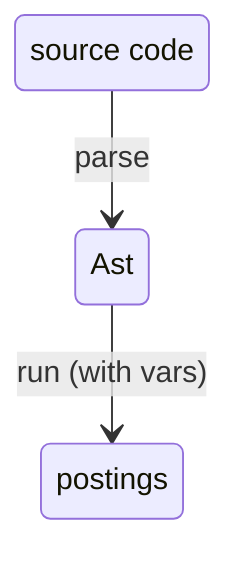
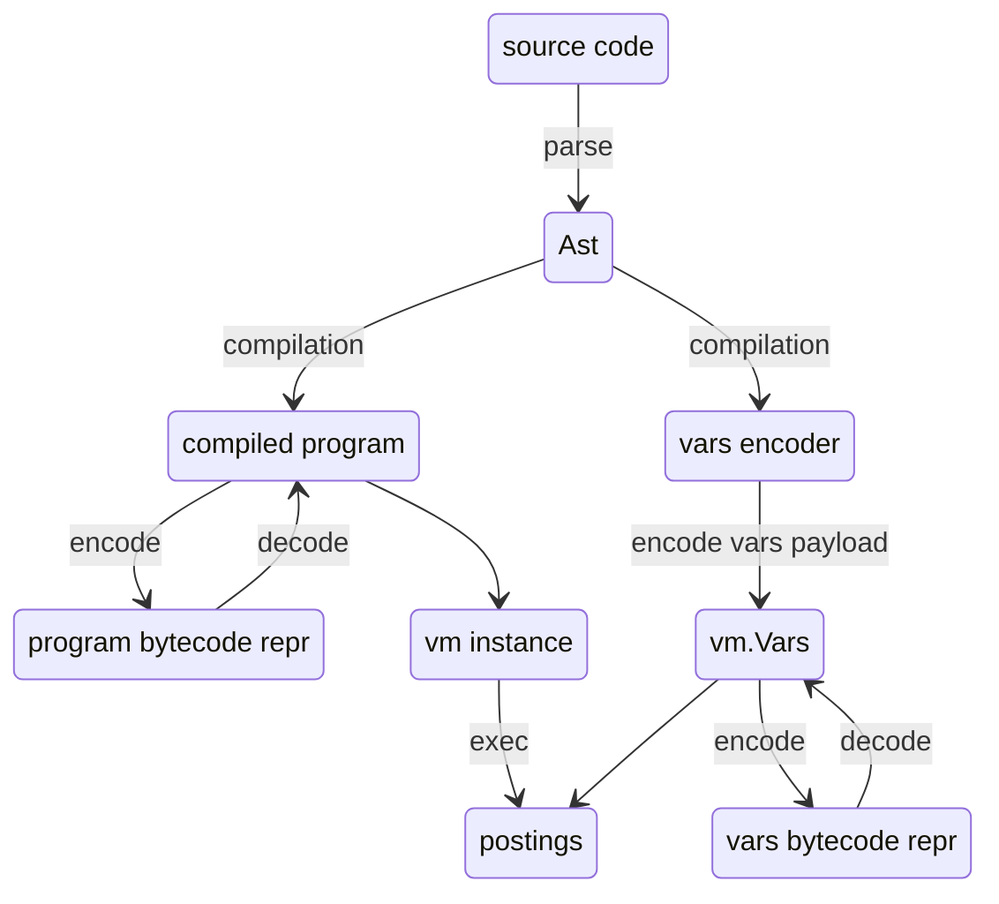

# Numscript vm architecture

## Design goals

Because of new requirements in the ledger v3, we are redesigning how numscript is architected.
Previous architecture (still implemented in this repo) consisted in a simple data flow:
We parsed the ast, and then walked the Ast to interpret it and emit postings:



while this is the simpliest architecture we could implement, and its performance was still good enough for our use cases, a few things changed with the ledger v3 design:
1. Higher ledger TPS: numscript is more likely to become a bottleneck. So it's now justified to pay with more complexity for better perfs. Tree walker interpreter is usually suboptimal, has a lot of pointer chasing, and makes it hard to optimise things
2. It needs a way to send the programs around the nodes in a compact and efficient way. This could be solved in the previous architecture by using the syntax itself as a serializations format, or with some rpc encoding, but would still require complex operations on the nodes
3. We now have a specific section which is sequential and needs maximum perf. So we now prefer and architecture that allows to have pre-computed optimisations in the parallel path, so that the sequential one is highly optimised

that lead to researching a new implementation that would fit those design goals better


## The overall architecture

We now compile the parsed Ast (using `compiler.Compile`) and get a `vm.Program` struct and a `compiler.VarsEncoder` struct (or a compilation error). The compiler can optionally run an optimisation pass.

The `vm.Program` is used to create a `vm.Vm` instance (via `vm.NewVm`). Creating a `vm.Vm` instance will allocate the relevant registers and data, but it's designed so that we can reuse the same `vm.Vm` instance across execution of the same program.

The `VarsEncoder` struct knows how to encode a json payload (a `map[string]string`) into `vm.Vars`.

Finally, we can obtain our postings and meta output by running the `vm.Exec` function, by passing the `vm.Vm` instance, a `Store` implementation (used by the vm to fetch balances and meta), and the `vm.Vars`.

An important property: Both `vm.Program` and `vm.Vars` can be encoded and decoded as bytes. This way, we can orchestrate the previously mentioned flow:
* The leader node can parse and pre-compile numscript into a `vm.Program` and keep the `compiler.VarsEncoder`. The `vm.Program` is serialised into bytes and sent to nodes, which'll deserialise it into `vm.Program` again, and used to crate the instance of the `vm.Vm`. 
* On each tx, the leader takes the json payload and turns it into `vm.Vars` with the `vm.Encoder`. `vm.Vars` are serialised, sent and deserialised back. Now node can finally run the highly optimised warm `vm.Vm` instance.

Diagram is roughly like this:



In the next section we'll see how each of those building blocks works exactly

## Vm architecture
The vm's instance is composed by:
* the `vm.Program` (the compilation artifact)
* registers
* the runtime's state, which keeps track of allocated funds and the accounts' balances.

The bytecode's instructions have a fixed 32bit size:

```go
package vm

type Instruction struct {
	Opcode byte
	A      byte
	B      byte
	C      byte
}
```

Because of the fixed-size, the vm can keep the hydrated buffer of `[]Instruction` stream instead of having to parse things on the fly at runtime (or without having to model it via heap-allocated structs) while still being compact enough to benefit good CPU locality.

Instructions come in 2 format: either `ABC` (3 arguments of 1 byte each) or `ABB` (2 arguments, with 1 having 1 byte size and the other a little endian repr of 2bytes).
If an instruction doesn't fit the 4 bytes limit, we simply extend it with the `Instruction` after that.

Instructions are fetched and evaluated one at the time until they are finished (no HALT instructions to stop, so that bytecode always terminates by design).

Instructions can move data by manipulating registers. Registers banks are separated by type (so that we don't have to have a single heap-allocated value, nor unsafe pointers or manually handled unsafe memory). With "type" here we mean the internal representation of data, which isn't the same as numscript types (there isn't necessarily a 1-1 relationship). For example, both strings, assets and accounts are represented via the golang `string` type.
> Note: we'll probably change accouts' representation when adding scopes

A simple example of an instruction is:
```
INT_ADD 0x00 0x01 0x02
```
which behaves like this:
```
int_registers[0x00] = int_registers[0x01] + int_registers[0x02]
```
Note that this model plays very well with golang's `big.Int` mutable API.

The instruction set has
* a few pure, binary or unary arithmetic/logic operations (int min, string add, int add, portion sub, etc)
* a few domain instructions which call the `runtime.RunState`'s API (such as `PULL_ACCOUNT`, `SEND_TO_ACCOUNT`, `SAVE`). Those domain primitive can allocate funds, pull them to allocate postings, etc. This runtime logic is shared with the interpreter implementation.
* conditional jumps (`JMP_IF_ZERO`), which can only jump forward (so that the vm always halts by design)
* a `MK_ALLOTMENT` instruction which computes the allotment-related calculations
* constant pool loading instructions: `LOAD_STR(dest:u8, idx:u16)`, which performs `str_regs[dest] = program.str_pool[idx]`, and `LOAD_INT`.
* `LOAD_VAR_STRING(dest:u8, idx:u16)`, which performs `str_regs[dest] = vars.str_pool[idx]`, and `LOAD_VAR_INT` instructions, to load vars encoded in the `vm.Vars` struct

The VM implementation itself is trivial, and most of the complexity is moved to the compiler

### Bytecode encoding

The program bytecode encoding is designed so that the hydration can be fast.
After a magic word (so that we reject right away random bytes that didn't come from the compiler), we have an header section.

```
| "NUMB"                   4 B  | magic
+-------------------------------+
| arr<u32>   (instructions) 8 B | headers
| arr<u8>    (data)         8 B |
| arr<u32>   (str tbl)      8 B |
| arr<u32>   (int tbl)      8 B |
+-------------------------------+
| ..bytes                       | body
+-------------------------------+

arr<T> (8 B)
+------------+------------+
| start u32  | size u32   |   size = bytes (count = size / sizeof T)
+------------+------------+
```

The header section's items order is pre-defined (the order in the ASCII drawing above).
But the compiler is free to arrange sections in the body however it's more convenient (e.g. it may perform optimization to ensure padded sections in the future).
Each `arr` header describes a slice of data (relative to the beginning of the body section).

The instructions section describes a slice of bytes that gets hydrated into a `[]vm.Instruction` slice when `vm.Program` is parsed.

> Note: this design would make it possible to have very fast hydration by re-intepreting the instruction slice via unsafe casting, or by using mmap. In our case this is more dangerous than useful, but it's a nice property to have

The str and int table are an array of indexes of constants encoded in the data section.
Each element points to the _start_ of a constant in the data section.

In the data section, data are encoded this way:

```
string
+-------------+------------------+
| size : u32  | raw bytes ...    |   size = byte length
+-------------+------------------+

int
+------+-------------+---------------------+
| sign | magSz : u32 | magnitude bytes ... |   sign: 0 = non-neg, 1 = neg
+------+-------------+---------------------+
  1 B                  little-endian, unsigned
```

The string encoding allows easy access via slices.
The int encoding is the default one used by the `.Bytes()` and `.SetBytes()` methods of `big.Int`.

> NOTE: big.Int are actually currently big endian. We still need to reverse the bytes

This repr allows us to quickly hydrate the bytecode into a `[]string` and `[]big.Int` slices to keep in the `vm.Program`.

### Vars encoding

`vm.Vars` uses the exact same encoding, just without instructions. The magic word is `"NVAR"`, and the header only has 3 items:

```
| "NVAR"                   4 B  | magic
+-------------------------------+
| arr<u8>    (data)         8 B | headers
| arr<u32>   (str tbl)      8 B |
| arr<u32>   (int tbl)      8 B |
+-------------------------------+
| ..bytes                       | body
+-------------------------------+
```

The data section, str table and int table work in the exact same way as the program's. In fact the encoding/decoding code for the pools is shared between the two.

An important property is that the `vm.Vars` don't have a 1-1 correspondence with the vars. The `vm.Vars` only encodes ints and strings. Composite objects, such as monetaries, are split into 2 different vars. This keeps data encoding minimal, and makes optimizations surface simplier to implement (see optimisations section below).

The compiler is free to chose any encoding it wants for the vars (the first value in the str table doesn't have to be the first string variable). Behaviour can change across versions.

### Soundness verification
TODO!

## Compiler
TODO!

### Optimisations
TODO!


